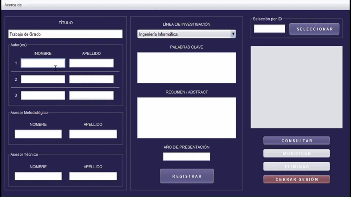

# Sistema de Gestión de Trabajos Especiales de Grado (TEG)

Plataforma de escritorio desarrollada en **Java** para la gestión administrativa de los Trabajos Especiales de Grado (TEG). Permite a los usuarios con rol de administrador realizar un control completo sobre los TEGs, desde su registro inicial hasta la consulta de éstos.



## Características Principales

- **Control de Acceso (Login):** Autenticación de usuarios con roles definidos para acceso seguro.
- **Gestión CRUD:** Funcionalidades completas para **Registrar, Consultar, Editar y Eliminar** proyectos TEG.
- **Gestión de Datos Académicos:** Almacenamiento organizado de títulos, autores, asesores, resúmenes, líneas de investigación, etc.
- **Persistencia de Datos:** Conexión y almacenamiento de la información en una base de datos **MySQL**.
- **Interfaz de Usuario:** Aplicación de escritorio estable y funcional.

## Tecnologías Utilizadas

### Backend y Lógica
*  **Java:** Lenguaje principal de desarrollo.
* **JDBC:** Uso de la API Java Database Connectivity para la conexión con la base de datos.

### Base de Datos
*  **MySQL:** Motor de base de datos relacional para el almacenamiento persistente.

## Estructura del Proyecto

```text
sistema-teg/
├── database/        # Archivo teg.sql con la estructura de la base de datos
├── lib/             # Librerías (Drivers JDBC, etc.)
├── nbproject/       # Configuraciones de NetBeans
├── src/             # Código fuente en Java (.java)
├── .gitignore       # Archivo de ignorados de Git
└── README.md        # Documentación del sistema
```

## Instrucciones de Instalación
Para poder correr este sistema, necesitas tener instalado JDK (Java Development Kit) y un gestor de bases de datos (como XAMPP/WAMP para MySQL).

### 1. Configuración de la Base de Datos
Crea una base de datos vacía llamada teg.

Importa el script teg.sql que se encuentra en la carpeta /database a tu instancia de MySQL.

### 2. Configuración de Conexión
El archivo de configuración de la conexión a la base de datos se encuentra en: /src/config/Conexion.java.

Asegúrate de que los valores coincidan con tu configuración local (usuario y contraseña de MySQL):

```text
Java

private static final String URL = "jdbc:mysql://localhost:3306/teg";
private static final String USER = "root"; // Tu usuario de MySQL
private static final String PASSWORD = ""; // Tu contraseña de MySQL
```

## Instrucciones de Ejecución
Para correr este programa en tu computadora, necesitas tener instalado el JDK (Java Development Kit).

### Opción A: Desde un IDE (Recomendado)

Abre NetBeans, IntelliJ o Eclipse.

Selecciona "File" > "Open Project".

Navega a la carpeta donde clonaste este repositorio y ábrelo.

Ejecuta el archivo principal (Main.java o similar dentro de src).

#### Credenciales Iniciales (incluidas en el .sql):

- **Usuario:** admin

- **Clave:** 1234

## Historial del Proyecto
Fecha de Realización: Abril del 2024.

Tipo: Sistema de Gestión (Trabajo Especial de Grado).

Estado: 🟢 Finalizado.
